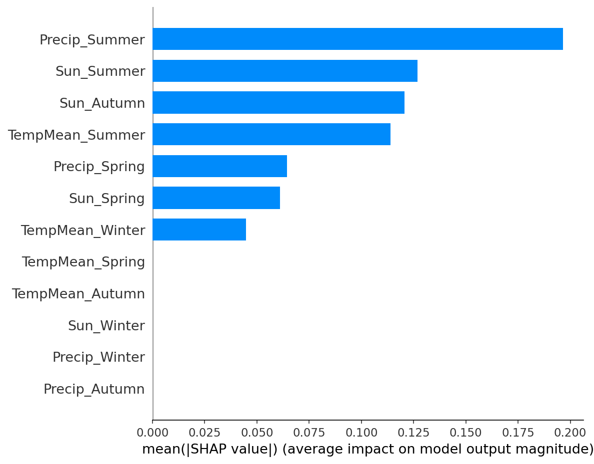

# Interpretable Machine Learning for Seasonal Weather-Driven Yield Prediction in Irish Arable Crops

MSc Artificial Intelligence capstone project, University of Galway.

This project looks at which seasonal weather conditions most influence crop yield in Ireland. It uses 41 years (1985-2025) of national yield data for nine tillage crops, together with weather data from Met Éireann, and compares four machine learning models (XGBoost, Random Forest, EBM and TabNet). To my knowledge, no earlier machine learning study had looked at weather-driven yield for Irish arable crops.

## Key results

- Weather relationships confirmed by permutation testing for **four of nine crops**: Spring Barley, Potatoes, Spring Oats and Spring Wheat.
- **Summer rainfall** was the most consistent driver of yield across all four crops. Wetter summers were associated with lower yield, confirmed by XGBoost, Random Forest and EBM.
- **Winter-sown crops** showed no statistically reliable weather relationship under the shared modelling setup.
- **XGBoost** performed best overall. **TabNet** performed worst, which was expected given only about 40 observations per crop.

| Crop | XGBoost R² | Random Forest R² | EBM R² | TabNet R² |
|---|---|---|---|---|
| Spring Barley | 0.414 | 0.228 | 0.201 | -0.286 |
| Potatoes | 0.401 | 0.155 | 0.139 | -0.102 |
| Spring Oats | 0.337 | 0.207 | 0.264 | -0.152 |
| Spring Wheat | 0.272 | 0.232 | 0.146 | 0.214 |



*SHAP feature importance for Spring Wheat (XGBoost). Plots for the other crops and models are in `figures/`.*

## Data

- **Crop yield:** annual yield for nine crops from the Central Statistics Office (CSO), 1985-2025.
- **Weather:** monthly temperature, rainfall and sunshine from Met Éireann (Dublin, Shannon and Cork airports), accessed via the CSO open data portal.


## Repository structure

```
├── WeatherData.ipynb           # loads and processes the Met Éireann weather data
├── DataAnalysis.ipynb          # data exploration and feature engineering
├── BaselineModelTesting.ipynb  # baseline model experiments
├── XGBoostAndRF.ipynb          # XGBoost and Random Forest models
├── EBM.ipynb                   # Explainable Boosting Machine
├── TabNet.ipynb                # TabNet
├── BaselineModels.html         # HTML export of the baseline model results
├── figures/                    # SHAP, EBM and TabNet feature importance plots
└── requirements.txt
```

## Getting started

Install the dependencies with `pip install -r requirements.txt`. The notebooks are independent and can be run in any order, but they take a long time to run.

